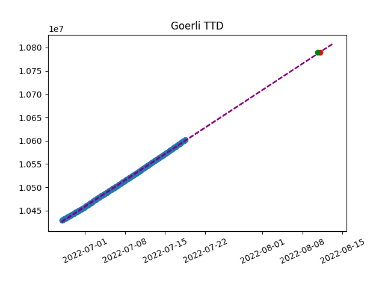

## Goerli Merge prediction

Verifying proposed TTD https://github.com/ethereum/execution-specs/pull/563

Goerli is a PoA network which allows easy linear prediction. Purpose is to [verify proposed TTD value](https://github.com/ethereum/execution-specs/pull/563). This directory contents code tweaked for Goerli and collected data. 

Current prediction fits proposed value: 


```
Total Terminal Difficulty of 10790000 is expected around Thu Aug 11 01:00:00 2022 UTC. <p></p>

```
You can verify it by running: 

```
python3 wengoerli.py --ttd 10790000 --time 1660140000
``` 


