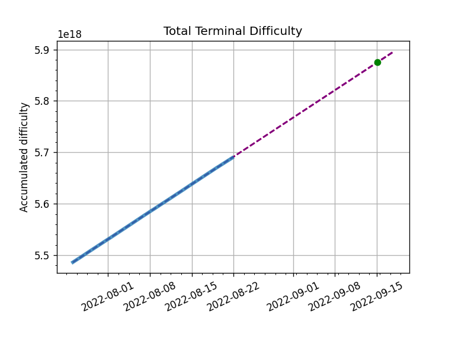
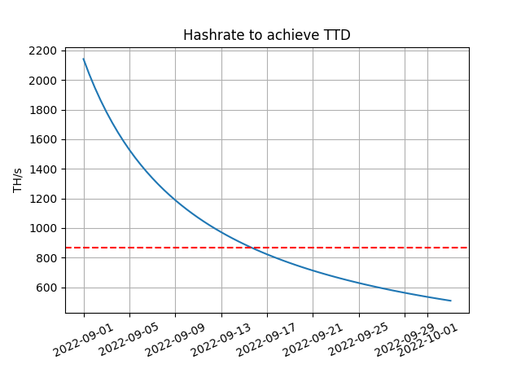

## Mainnet Merge prediction

Ethereum Mainnet is getting close to merging. Mainnet TTD value was proposed at [Execution call #93](https://www.youtube.com/watch?v=CIAGQMUKEZ4) based on [this analysis](https://notes.ethereum.org/@MarioHavel/merge-ttd) which was presented on the call. 

Proposed value was comfirmed and client releases are shipped with this Merge value configured. Let's verify when the value is going to be reached and track the progress.

This directory contains few weeks of collected data, use the prediction tool to update them and create a projection: 

```
python3 wenmerge.py --ttd 58750000000000000000000 --time 1663243200
```

Current prediction fits proposed value: 



```
Total Terminal Difficulty of 58750000000000000000000 is expected around Thu Sep 15 04:14 UTC 2022, i.e. between Thu Sep 14 05:24 UTC 2022 and Thu Sep 16 03:04 UTC 2022
Total Terminal Difficulty at time Thu Sep 15 12:00:00 2022 UTC is expected around value 58781002179534517174272
Current daily hashrate: 863.7 TH/s
To achieve TTD 58750000000000000000000 at Thu Sep 15 12:00:00 2022 UTC, around 869.9 TH/s in the network is needed as of now.
```

Output gives us certain borders in its accuracy but it fully depends on whether hashrate stays stable or moves significantly. We can use `hashrate_ttd.py` to estimate when will be TTD reached if average hasshrate drops or grows to certain value. 



