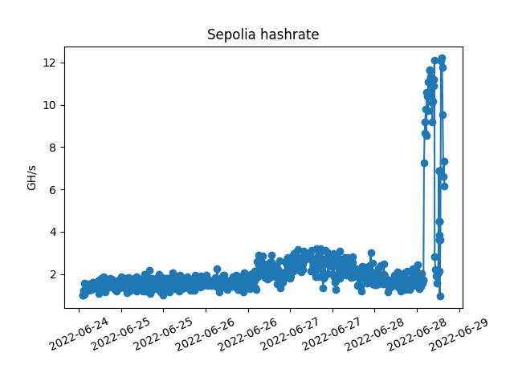

## Sepolia Merge prediction
To get estimation of hashrate needed to achieve target on time, run the script with the TTD target and time target values.
```
python3 wensepolia.py --ttd 17000000000000000 --time 1657119600 
``` 
Prediction when mining began. Let's move the red dot to the green one!



